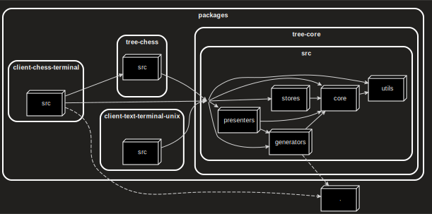

# Tree

### Tree chess in terminal
run dev:
``` bash
npx nx run client-chess-terminal:serve
```


### Tree text nodes terminal (unix) visualizer 
run dev:
``` bash
npx nx run client-text-terminal-unix:serve
```


### Structure

